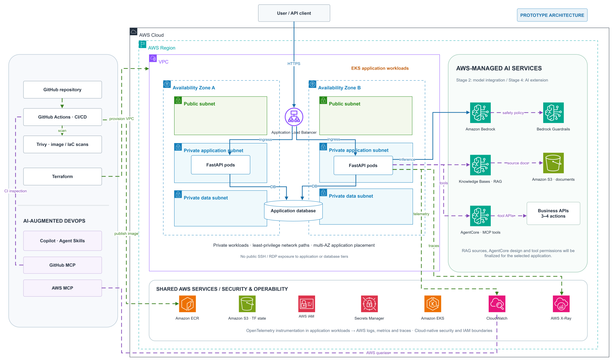

# Cloud AI Platform

An AWS application project covering cloud infrastructure, container orchestration, automated delivery, security, observability, and AI systems integration.

**Application use case is TBD**

## Technologies

| Area | Technologies |
| ---- | ------------ |
| Application | Python, FastAPI, PostgreSQL |
| Cloud & Infrastructure | AWS, Terraform, Amazon S3 |
| Containers & Orchestration | Docker, Amazon ECR, Kubernetes, Amazon EKS |
| CI/CD & Scanning | GitHub Actions, Trivy |
| Security & Operations | IAM, AWS Secrets Manager |
| Observability | OpenTelemetry, Amazon CloudWatch, AWS X-Ray |
| AI | OpenAI Responses API, Amazon Bedrock |
| AI Tooling | GitHub MCP, AWS MCP, Agent Skills |
| AI Systems | Bedrock Knowledge Bases, AgentCore Runtime & Gateway, Bedrock Guardrails |

## Development Stages

1. **Application & Local AI** — Build the application and integrate the OpenAI API with structured outputs, validation, and error handling.
2. **Cloud & DevOps** — Deploy on AWS, integrate Bedrock, and implement infrastructure automation, containers, CI/CD, private networking, security, observability, and reliability testing.
3. **AI-Augmented DevOps** — Use MCP and Agent Skills to inspect deployments, troubleshoot infrastructure, and automate engineering checks.
4. **Cloud AI Systems** — Extend the application with secure RAG, MCP tool integrations, access controls, guardrails, distributed tracing, and AI evaluations.

See the [Roadmap](ROADMAP.md).